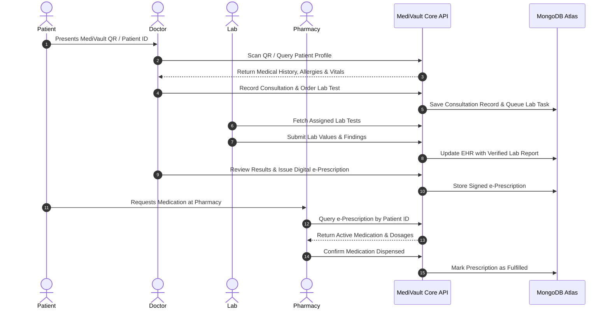

# 🏥 MediVault: Architecture, Engineering & Product Case Study
**Live Deployment:** [https://medivaultdashboard.netlify.app](https://medivaultdashboard.netlify.app)  
**Repository:** [GitHub / sarathsureshc / MediVault](https://github.com/sarathsureshc/MediVault)  
**Target Sector:** Digital Healthcare & Electronic Health Records (EHR)

---

## 1. Executive Summary

**MediVault** is a next-generation, patient-centric Electronic Health Records (EHR) and clinical workflow management ecosystem. Designed to dismantle the silos of traditional healthcare administration, MediVault provides a unified, zero-trust platform bridging **Patients, Doctors, Diagnostic Laboratories, Pharmacies, and Regulatory Compliance Administrators**.

By combining **instant QR-code-based data delegation**, **cryptographic Role-Based Access Control (RBAC)**, **e-Prescription fulfillment pipelines**, and an **immutable malpractice compliance audit engine**, MediVault replaces fragmented paper records and isolated hospital software with a secure, real-time clinical operating system.

---

## 2. The Real-World Healthcare Problem

### 2.1 The Data Fragmentation Crisis
In modern healthcare systems, patient medical histories are scattered across disparate private clinics, diagnostic centres, hospitals, and pharmacies:
- **Physical Paper Records:** Handwritten prescriptions and paper lab results are easily lost, damaged, or unreadable, leading to diagnostic errors and repetitive diagnostic expenses.
- **Siloed Hospital Systems:** Existing hospital management software (HMS) operates in isolated data islands. When a patient visits a new specialist, the doctor has zero visibility into their previous diagnoses, allergy histories, or chronic medication regimes.
- **Emergency Delays:** In acute emergency scenarios (trauma, unconsciousness, stroke), first responders and ER doctors cannot quickly access vital data such as blood group, preexisting medical conditions, or drug allergies.

### 2.2 Clinical Vulnerabilities & Administrative Overhead
- **Prescription Tampering & Drug Abuse:** Unverified paper prescriptions are vulnerable to unauthorized refills, dosage alterations, and pharmacy fraud.
- **Diagnostic Turnaround Latency:** Diagnostic labs struggle to seamlessly hand off reports to consulting physicians, causing delayed treatment decisions.
- **Malpractice Tracking & Dispute Resolution Gaps:** Traditional clinics lack tamper-evident digital audit logs to investigate medical negligence, incorrect prescription dosages, or unauthorized access to sensitive patient health records.
- **Patient Privacy Disempowerment:** Patients historically have no ownership or visibility into who views, modifies, or shares their confidential clinical files.

---

## 3. How MediVault Solves the Problem

MediVault reimagines healthcare data flow with an interconnected, 5-role clinical architecture:

```
                      ┌─────────────────────────────────┐
                      │    🛡️ MediVault Cloud Core       │
                      │  (Node.js / Express / MongoDB)  │
                      └───────────────┬─────────────────┘
                                      │
        ┌───────────────┬─────────────┼───────────────┬───────────────┐
        │               │             │               │               │
        ▼               ▼             ▼               ▼               ▼
 🧑‍⚕️ Doctors      🧪 Labs       💊 Pharmacy     🏥 Patients     ⚖️ Admin & Audit
 (Consultations, (Diagnostic   (Prescription  (Health Vault,  (Malpractice &
  Prescriptions,  Tests &       Fulfillment &  QR Access,      Compliance
  EHR Access)     Biomarkers)   Verification)  History)        Supervision)
```

### 3.1 Key Architectural Solutions
1. **Dynamic Patient Health Passport & Instant QR Handshake:**
   - Every patient is assigned a unique digital MediVault ID with an on-demand QR code.
   - Attending physicians, laboratory staff, and pharmacists can scan the patient's QR code to instantly verify identity and securely load clinical history without friction.
2. **Unified 5-Role Ecosystem:**
   - **Patient:** Retains sovereign ownership of all medical history, past diagnoses, active prescriptions, lab reports, and doctor appointments.
   - **Doctor:** Accesses longitudinal patient histories, initiates consultations, records diagnoses, and digitally issues structured e-prescriptions.
   - **Diagnostic Lab:** Receives doctor test orders, inputs biometric test results, uploads diagnostic documentation, and delivers immediate digital notifications to the doctor and patient.
   - **Pharmacy:** Pulls verified e-prescriptions in real-time, validates dosages and drug interactions, and marks items as fulfilled/dispensed.
   - **Compliance & Admin:** Monitors cross-network clinical integrity, tracks malpractice dispute filings, enforces regulatory standards, and audits system access logs.
3. **Resilient Cloud & Cold-Start Fault Tolerance:**
   - Designed for serverless/containerized cloud economics: features an automatic client-side cold-start detection and auto-retry pipeline that shields end-users from cloud spin-up latency.
4. **Comprehensive Security & Dual-Factor Recovery:**
   - Dual authentication mechanisms with multi-channel OTP dispatch (Email SMTP & Phone SMS fallback) for secure password recovery and sensitive profile modifications.

---

## 4. Technology Stack & Engineering Justifications

| Layer | Technologies Used | Key Rationale |
| :--- | :--- | :--- |
| **Frontend Framework** | **Next.js 16 (App Router, Turbopack)** | Server-side rendering (SSR) for blazing performance, automatic static optimization across 21 routes, built-in code-splitting, and SEO compliance. |
| **UI Library & State** | **React 19, Tailwind CSS v4, Framer Motion** | Micro-interactions, responsive mobile-first layouts, glassmorphic themes, and component styling. |
| **Icons & Visuals** | **Lucide React, QRCode.react, HTML5-QRCode** | Clean medical iconography, client-side dynamic QR generation, and in-browser camera-based QR barcode scanning. |
| **Backend Runtime** | **Node.js, Express.js (ES6 / TypeScript)** | High-throughput non-blocking asynchronous I/O, modular router controllers, and enterprise-grade TypeScript compile-time safety. |
| **Database & ODM** | **MongoDB Atlas, Mongoose ODM** | Schemaless document flexibility ideal for evolving healthcare data structures (variable lab test parameters, dynamic prescription matrices). |
| **Security & Auth** | **JWT (Access/Refresh), bcryptjs, Helmet, CORS** | Stateless token authentication, cryptographic password hashing, strict HTTP headers, and fine-grained origin validation. |
| **Communication** | **Nodemailer (SMTP), Axios Interceptors** | Multi-channel OTP delivery for account verification and automatic request queuing/retry on cloud cold-starts. |
| **Deployment & CI/CD**| **Netlify (Edge Frontend), Render (API Core)** | Global CDN edge caching for UI delivery paired with containerized backend execution. |

---

## 5. System Architecture & Workflows

### 5.1 The Consultation & Prescription Lifecycle


### 5.2 Enterprise Malpractice & Audit Trail System
- Every clinical transaction (consultation notes, prescription issuance, report modification) is stamped with the practitioner's verified ID and timestamps.
- The **Admin Malpractice & Compliance Portal** provides regulatory oversight:
  - Tracks and flags suspicious prescribing anomalies.
  - Allows patients or peer reviewers to submit structured malpractice inquiries.
  - Enables administrators to review clinical event chronologies, suspend compromised accounts, and ensure compliance with healthcare standards.

---

## 6. Key Engineering Innovations

1. **Intelligent Server Wake-Up & Resilient State Engine:**
   - Free/serverless cloud backends (such as Render) enter sleep states after inactivity.
   - MediVault's frontend features an active health monitor (`ServerStatusContext` + `ServerWakeupBanner`) that detects sleeping servers, displays real-time server readiness status to the user, and automatically retries pending API calls via Axios interceptors without page refreshes.
2. **Camera-Integrated QR Scanning:**
   - Built directly into the browser via `html5-qrcode`, allowing clinic intake desks and pharmacies to scan patient screens or ID cards using any laptop webcam or mobile camera.
3. **Strict Origin Security & Express 5 Compatibility:**
   - Production CORS middleware with dynamic origin validation supporting Netlify preview branches, wildcard subdomains, and credentialed cookie handling.

---

## 7. Business & Clinical Impact

- **Zero Paper Loss:** 100% digital transition for prescriptions, test results, and clinical notes.
- **Sub-Second Patient Intake:** Doctors access a patient's entire longitudinal history in under 1 second via QR identification.
- **Preventable Error Reduction:** Clear digital e-prescriptions eliminate handwriting misinterpretations and invalid drug dosages.
- **Trust & Compliance:** Transparent audit trails empower regulatory boards and protect patients from medical malpractice.

---

## 8. Future Roadmap

- **ABDM / FHIR / HL7 Interoperability:** Integrating standard clinical data exchange formats for nationwide healthcare registry synchronization.
- **AI-Powered Diagnostics Assistant:** Machine learning models for automatic biomarker trend visualization, potential drug-drug interaction warnings, and radiology report summarization.
- **Telemedicine WebRTC Integration:** Encrypted peer-to-peer video consultations built directly into the doctor-patient portal.
